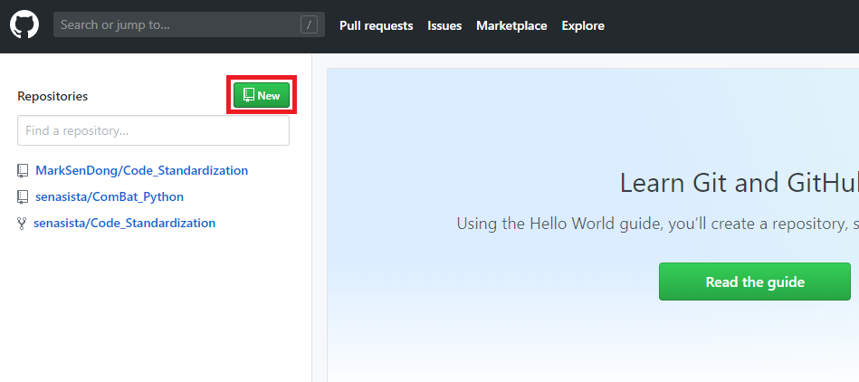
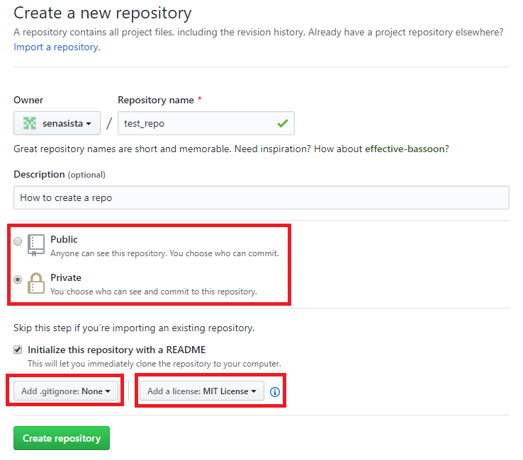

# Getting started with GitHub

### 1. The 10 minutes quick start guide
You’ll learn how to: 
- Create and use a repository
- Start and manage a new branch
- Make changes to a file and push them to GitHub as commits
- Open and merge a pull request

https://guides.github.com/activities/hello-world/ 

### 2. Video Tutorial series from Github official channel on Youtube
https://www.youtube.com/playlist?list=PLg7s6cbtAD15G8lNyoaYDuKZSKyJrgwB- 
**Recommended to watch in order to get a comprehensive understanding of the concept of Git as well as most of the main functions!!!** 
 

### Additional tips
**1. New Repository** 
Please find the botton to create new repository at the top left corner of your main dashboard once logged in. 

 
 
**2. Private Repository** 
If you do not want to allow the public to have access to your reppository, please remember to select **private repository** upon creation. 
If you want to change your repo privacy setting after the creation, you can find it in 'Settings' at the top right corner of the repo's main page, scroll to the bottom where it says 'Danger Zone' and modify privacy setting there. 
 
To change your repo's privacy settings later on, simply follow the short tutorial here: 
https://help.github.com/en/articles/setting-repository-visibility 
 
**3. .gitignore** 
If you want to upload local files to github, but you would like to ignore some specific file types from uploading, you can select the file type to be ignored here. 
 
**4. Choosing an appropriate open source license** 
If you would like to publish your code one day to the public, in order to avoid copyright infringement or other issues, you can select a default open source lisnece to go with your repo. 
You can find a guide on how to choose open source license here: 
https://choosealicense.com/ 
 

 

**5. README.md** 
It is usually mandatory to include a README.md file in your repo, just like in this repo. 
The file should provide an introduction or description of the repo: 
- what it is
- what it does
- how does it work
- what it includes 
It has different syntax than normal text editing or word. 
If you need help on how to stylise your README.md file, click the link here: 
https://help.github.com/en/articles/basic-writing-and-formatting-syntax 
 

**6. Github GUI** 
Git by default is a commandline tool. 
As a website, Github gives you the option to use an online GUI for managing your repo. 
But if you want to take a step further, there are 2 options.  
 
&nbsp;&nbsp;&nbsp;&nbsp;**Github Desktop**(*Windows, MacOS, not available for Linux*): 
&nbsp;&nbsp;&nbsp;&nbsp;Download link: https://desktop.github.com/ 
&nbsp;&nbsp;&nbsp;&nbsp;**Short Getting Started Video (9 mins): https://www.youtube.com/watch?v=ci3W1T88mzw** 
&nbsp;&nbsp;&nbsp;&nbsp;Tutorials: https://help.github.com/en/desktop/getting-started-with-github-desktop 
&nbsp;&nbsp;&nbsp;&nbsp;One of the most convenient way of using github, and most of the time I use it to manage and work with github. 
 
&nbsp;&nbsp;&nbsp;&nbsp;**Gitkraken**(*Linux, MacOS, Windows*): 
&nbsp;&nbsp;&nbsp;&nbsp;Download link: https://www.gitkraken.com/download 
&nbsp;&nbsp;&nbsp;&nbsp;How to install: https://support.gitkraken.com/how-to-install/ 
&nbsp;&nbsp;&nbsp;&nbsp;Link Gitkraken to your Github account: https://support.gitkraken.com/integrations/github/ 
&nbsp;&nbsp;&nbsp;&nbsp;**Short Getting Started Video (6 mins): https://www.youtube.com/watch?v=ub9GfRziCtU** 
&nbsp;&nbsp;&nbsp;&nbsp;Basic Tutorials: https://support.gitkraken.com/start-here/guide/ 
&nbsp;&nbsp;&nbsp;&nbsp;I have not used it since I work mainly on Windows PC. But for Linux users, Github Desktop is not yet available. 
&nbsp;&nbsp;&nbsp;&nbsp;In this case, Gitkraken is one of the best Github GUI out there, and it is free for personal use. 
 
